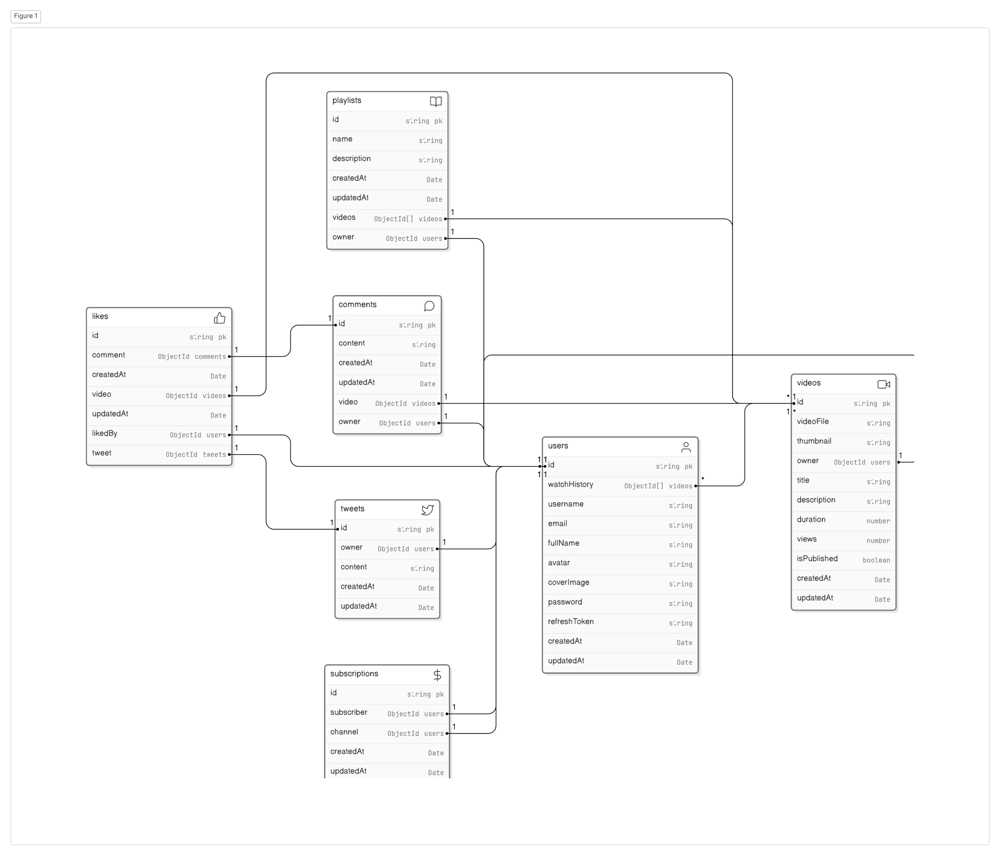

# backend Journey 
backend projects with javascript
<<<<<<< HEAD

Summary of this project :

This project is a complex backend project that is built with nodejs, expressjs, mongodb, mongoose, jwt, bcrypt, and many more. This project is a complete backend project that has all the features that a backend project should have. building a complete video hosting website similar to youtube with all the features like registration, login, signup, upload video, like, dislike, comment, reply, subscribe, unsubscribe,  Tweets : createTweet, getUserTweets, updateTweet, deleteTweet and many more. used aggregration pipeline and CRUD opertions and more.

Project uses all standard practices like JWT, bcrypt, access tokens, refresh Tokens and many more. i spent a lot of time in building this project and i learned a lot from this project
=======
>>>>>>> d8c695d5e2077677581dc1ac6ccf378fef968800
